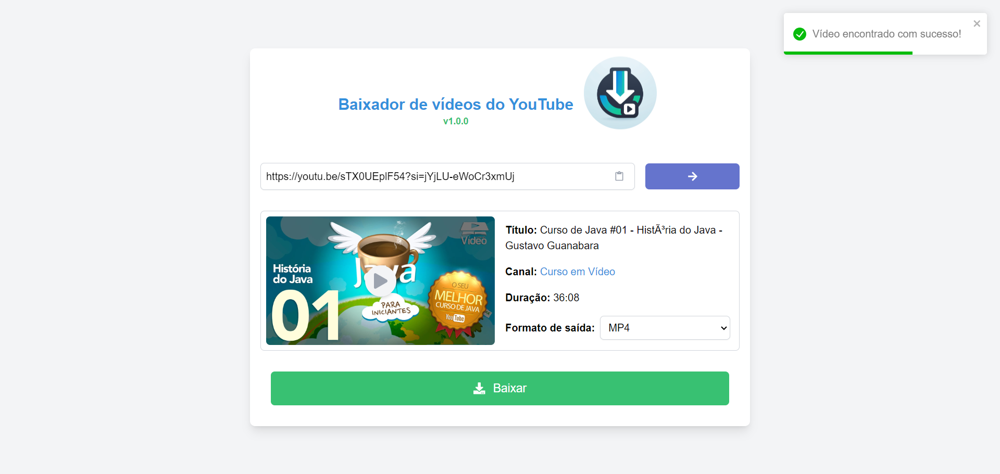

# Baixador de Vídeos do YouTube com Pytube

## Sobre o projeto

Este projeto é um aplicativo web simples desenvolvido em React para baixar vídeos do YouTube de forma eficiente, utilizando a biblioteca Python Pytube. O aplicativo oferece uma interface intuitiva para que os usuários possam inserir links de vídeos do YouTube, obter informações detalhadas sobre os vídeos e realizar o download no formato desejado.

## Funcionalidades

1. Busca de Vídeos:

- Os usuários podem inserir links de vídeos do YouTube na interface.
- O aplicativo utiliza a API Pytube para obter informações detalhadas sobre o vídeo.

2. Detalhes do Vídeo:

- Após a busca bem-sucedida, são exibidos detalhes como título, canal, duração e miniatura do vídeo.

3. Download Eficiente:

- Os usuários podem escolher o formato desejado para o download (MP4 ou MP3).
- O download é iniciado, proporcionando uma maneira fácil e rápida de obter vídeos do YouTube.

## Tecnologias utilizadas

### Frontend

- Vite
- React
- Typescript
- Tailwind CSS
- Axios

### Backend

- Python
- FastAPI
- Pytube
- Pytest

## Screenshot

Abaixo está um screenshot do aplicativo em execução.



## Executando o projeto

### Pré-requisitos

- Docker
- Docker Compose

### Executando o projeto

1. Clone o repositório

```bash
git clone https://github.com/rafaelmachadobr/video-download-youtube-web.git
```

2. Acesse a pasta do projeto

```bash
cd video-download-youtube-web
```

3. Execute o comando abaixo para iniciar o aplicativo

```bash
docker-compose up -d
```

4. Acesse o aplicativo em http://localhost:3000

5. Para parar o aplicativo, execute o comando abaixo

```bash
docker-compose down
```

# Licença

Este projeto está licenciado sob a Licença MIT - consulte o arquivo [LICENSE](LICENSE) para obter detalhes.
